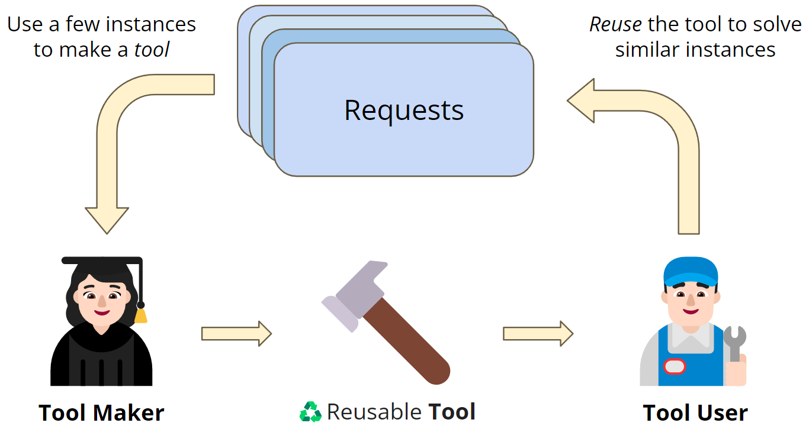
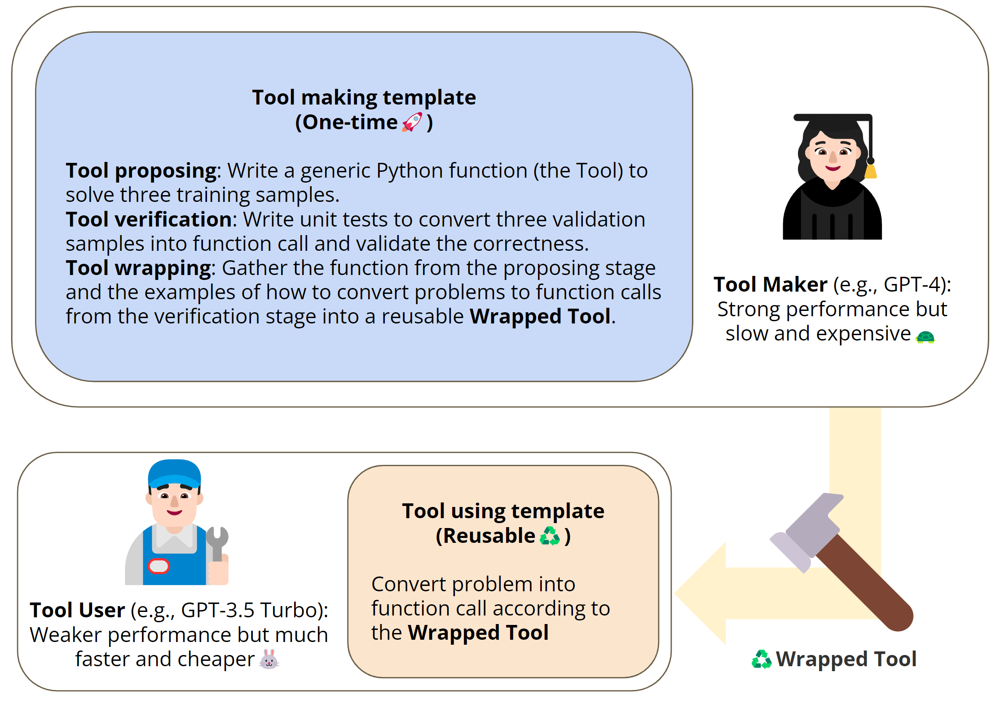
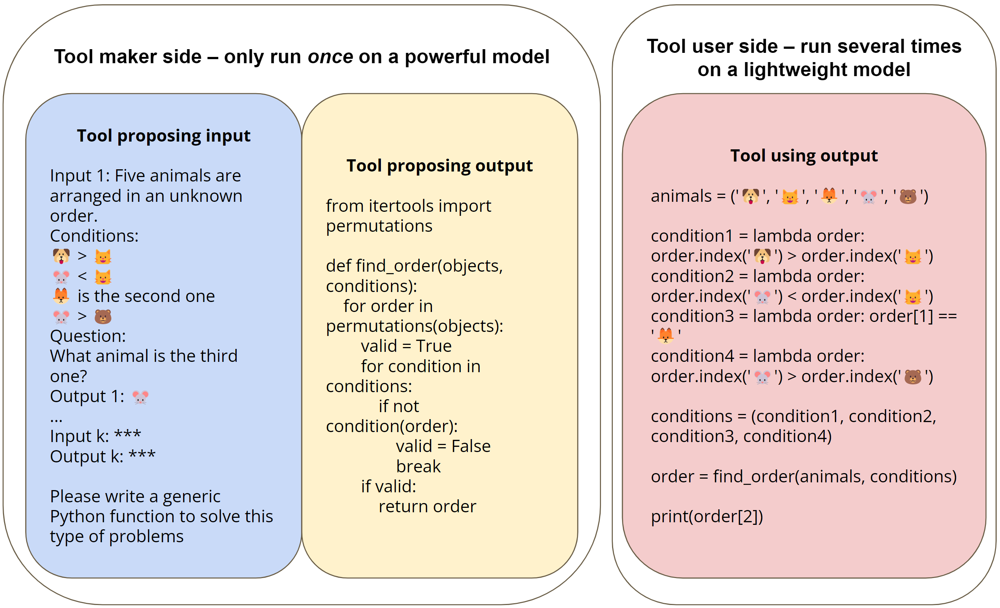

# Large Language Models as Tool Makers
*Tianle Cai, Xuezhi Wang, Tengyu Ma, Xinyun Chen, Denny Zhou*

[Paper link](https://arxiv.org/abs/2305.17126)

## Motivation
Recent research shows the potential of enhancing the problem-solving ability of
large language models (LLMs) through the use of external tools. However, prior
work along this line depends on the availability of existing tools. In this work, we
take an initial step towards removing this dependency by proposing a closed-loop
framework, referred to as LLMs A s Tool M akers (LATM), where LLMs create
their own reusable tools for problem-solving. 

## Overview
Our approach consists of two key
phases: 1) tool making: an LLM acts as the tool maker that crafts tools for given
tasks, where a tool is implemented as a Python utility function. 2) tool using:
an LLM acts as the tool user, which applies the tool built by the tool maker for
problem-solving. The tool user can be either the same or a different LLM from the
tool maker. Tool-making enables an LLM to continually generate tools that can be
applied to different requests so that future requests can call the corresponding APIs
when beneficial for solving the tasks.

<!--  width 80% and centered -->
<p align="center">
  
</p>

Furthermore, the division of labor among
LLMs for tool-making and tool-using phases introduces the opportunity to achieve
cost effectiveness without degrading the quality of generated tools and problem
solutions. For example, recognizing that tool-making demands more sophisticated
capabilities than tool-using, we can apply a powerful yet resource-intensive model
as the tool maker, and a lightweight while cost-effective model as the tool user. We
validate the effectiveness of our approach across a variety of complex reasoning
tasks, including Big-Bench tasks. With GPT-4 as the tool maker and GPT-3.5 as
the tool user, LATM can achieve performance that is on par with using GPT-4 for
both tool making and tool using, while the inference cost is significantly reduced.

## Pipeline
<p align="center">
  
</p>
 LATM can be divided into two stages: 1) tool making: a powerful
yet more expensive model serves as the tool maker to generate generic and reusable tools from a
few demonstrations; 2) tool using: a lightweight and cheaper model serves as the tool user to use
the tool to solve various instances of the task. The tool-making stage can be further divided into
three sub-stages: (i) tool proposing: the tool maker makes an attempt to generate the tool (Python
function) from a few training demonstrations, if the tool is not executable, report the error and
generate a new one (fix the issues in the function); (ii) tool verification: the tool maker runs unit tests
on validation samples, if the tool does not pass the tests, report the error and generate new tests (fix
the issues in function calls in unit tests); and (iii) tool wrapping: wrapping up the function code and
the demonstrations of how to convert a question into a function call from unit tests, preparing usable
tools for tool user.

## Example
<p align="center">
  
</p>
An illustration of the Tool Proposing and Tool Using stages of the LATM pipeline
for the Logical Deduction task [Srivastava et al., 2022]. This task requires determining the order
of five objects based on several given conditions. In the Tool Proposing stage, the tool maker (such
as GPT-4) formulates a generic Python function capable of solving the provided k demonstrations
from the task (where k equals 3 in our experiments). The tool maker generates a search algorithm
that enumerates all possible orderings and verifies each against the provided conditions. During the
tool-using stage, the tool user translates each natural language question into a series of conditions,
generating function calls to utilize the tool for each task instance.

## Code structure
- schedule_meeting.ipynb -- notebook for constructing the schedule meeting dataset
- toolmaker.ipynb -- notebook for making tools, the wrapped tools are stored in tools folder and are ready to use
- tooluser.ipynb -- notebook for testing Tool User and Dispatcher
- bbh folder -- the tasks from BigBench in json format
- cot-prompts folder -- the Chain-of-Thought prompts

## Citation
```
@article{cai2023large,
  title   = {Large Language Models as Tool Makers},
  author  = {Tianle Cai and Xuezhi Wang and Tengyu Ma and Xinyun Chen and Denny Zhou},
  year    = {2023},
  journal = {arXiv preprint arXiv: 2305.17126}
}
```